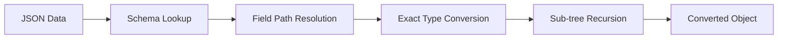

# JSDC Loader v2.0 Architecture Redesign
## Product Requirements Document (PRD)

---

## Executive Summary

JSDC Loader will undergo a complete architectural redesign to address fundamental issues with the current type conversion system. The new architecture will be **schema-driven**, **modular**, and **predictable**, eliminating runtime type guessing and providing deterministic conversion behavior.

---

## Current Problems & Pain Points

### 🔥 Critical Issues
- **Runtime Type Guessing**: Converter attempts to infer types at conversion time, leading to unpredictable behavior
- **Monolithic Architecture**: 1200+ line `converter.py` file with tightly coupled logic
- **Union Type Conflicts**: Priority-based guessing causes conflicts (e.g., `set` vs `tuple` confusion)
- **Maintenance Complexity**: Bug fixes in one area break other areas due to coupling
- **Unpredictable Behavior**: Same input can produce different outputs depending on Union type order

### ⚠️ Secondary Issues
- Performance overhead from repeated type analysis
- Difficult to extend with new type converters
- Complex debugging due to runtime decision-making
- Edge cases multiply as new types are added

---

## Product Vision

**"Conversion should be as predictable as the schema itself"**

A JSDC Loader where:
- ✅ Type conversion behavior is **100% deterministic**
- ✅ Schema analysis happens **once**, conversion happens **fast**
- ✅ Each converter has **single responsibility**
- ✅ Adding new types is **trivial**
- ✅ Debugging is **straightforward**

---

## Core Architecture Principles

### 1. Schema-First Design
```
Dataclass → Complete Type Schema → Conversion Pipeline → Data
```

### 2. No Runtime Guessing
- All type decisions made during schema building
- Converters perform exact type conversion only
- Union resolution strategies pre-defined

### 3. Modular Converter System
- Each converter handles one type family
- Clear separation of concerns
- Easy to test and extend

### 4. Fail-Fast Philosophy
- Conversion errors immediately halt the process
- No silent type mismatches
- Clear error messages with field paths

---

## Technical Requirements

### 🏗️ Core Modules

#### Schema Layer
```
📁 jsdc_loader/schema/
├── schema_builder.py     # Build complete type schemas
├── type_analyzer.py      # Analyze typing annotations  
└── field_schema.py       # Schema data structures
```

#### Converter Layer
```
📁 jsdc_loader/converters/
├── basic.py             # str, int, float, bool
├── containers.py        # List, Dict, Set, Tuple, Deque
├── special.py           # UUID, datetime, Enum, Decimal
├── dataclass.py         # Nested dataclass conversion
├── unions.py            # Union type with strategies
└── base.py              # Base converter interface
```

#### Pipeline Layer
```
📁 jsdc_loader/pipeline/
├── pipeline_builder.py  # Build conversion pipelines
├── registry.py          # Converter registry & dispatch
├── recursive.py         # Handle nested conversions (dataclass / other types)
└── coordinator.py       # Orchestrate the conversion
```

#### API Layer
```
📁 jsdc_loader/api/
├── loader.py            # jsdc_loads implementation
├── dumper.py            # jsdc_dumps implementation
└── exceptions.py        # Custom exceptions
```

### 🔧 Data Structures

#### TypeSchema
```python
@dataclass
class TypeSchema:
    root_type: Type
    field_schemas: Dict[str, FieldSchema]
    union_strategies: Dict[str, UnionStrategy]
    cache_key: str
```

#### FieldSchema  
```python
@dataclass
class FieldSchema:
    field_path: str
    exact_type: Type
    converter_type: ConverterType
    sub_schema: Optional[TypeSchema]
    union_strategy: Optional[UnionStrategy]
```

#### UnionStrategy
```python
@dataclass  
class UnionStrategy:
    branches: List[Type]
    resolution_order: List[str]  # ["enum_first", "str_fallback"]
    type_hints: Dict[str, Any]
```

### ⚙️ Conversion Pipeline



---

## Key Features

### ✅ Features to Keep

#### 1. **Atomic File Operations** (Critical)
- `jsdc_dump` writes to temporary file first
- On success: replace original file
- On error: remove temporary file
- **Zero data loss guarantee**

#### 2. **Full Type Support**
- All current supported types remain supported
- Basic types: `str`, `int`, `float`, `bool`
- Containers: `List`, `Dict`, `Set`, `Tuple`, `Deque`
- Special types: `UUID`, `datetime`, `Enum`, `Decimal`
- Advanced: `Union`, `Optional`, `Literal`, `Generic`

#### 3. **Performance**
- Schema caching for repeated operations
- Must match or exceed current performance

### 🚀 New Features

#### 1. **Deterministic Union Resolution**
```python
# Define explicit Union strategies
union_strategies = {
    "Union[Color, str]": UnionStrategy(
        resolution_order=["enum_first", "str_fallback"]
    ),
    "Union[List[int], Set[str], Tuple[str, ...]]": UnionStrategy(
        resolution_order=["list_first", "set_if_no_duplicates", "tuple_fallback"]
    )
}
```

#### 2. **Rich Error Messages**
```python
# Before: "Cannot convert value"
# After: "Cannot convert field 'user.settings.theme' from 'purple' to Literal['dark', 'light']"
```

#### 3. **Schema Introspection**
```python
schema = jsdc_get_schema(MyDataClass)
print(schema.field_schemas["user.name"].exact_type)  # <class 'str'>
```

#### 4. **Custom Converter Registration**
```python
@register_converter(MyCustomType)
class MyCustomConverter(BaseConverter):
    def convert(self, value: Any, schema: FieldSchema) -> MyCustomType:
        return MyCustomType(value)
```

---

## Success Metrics

### 🎯 Primary Goals
- **100% test pass rate** for existing test suite
- **Zero runtime type guessing** (measurable via code coverage)
- **< 50 lines per converter file** (maintainability)
- **Deterministic behavior** (same input → same output, always)

### 📊 Performance Goals  
- Schema building: **< 10ms** for typical dataclass
- Conversion speed: **>= current performance**
- Memory usage: **<= current usage**

### 🧪 Quality Goals
- **100% type coverage** in converters
- **Zero cyclomatic complexity > 5** in any function
- **Clear error messages** for all failure cases

---

## Implementation Plan

### Phase 1: Foundation (Week 1-2)
```
✅ Build schema layer
✅ Create basic converter interfaces  
✅ Implement pipeline coordination
```

### Phase 2: Core Converters (Week 3-4)
```
✅ Basic type converters
✅ Container converters
✅ Special type converters
```

### Phase 3: Advanced Features (Week 5-6)
```
✅ Union resolution strategies
✅ Dataclass converter
✅ Error handling & messages
```

### Phase 4: Integration & Testing (Week 7-8)
```
✅ API layer implementation
✅ Atomic file operations
✅ Full test suite migration
✅ Performance optimization
```

---

## Risk Analysis

### 🔴 High Risk
- **Breaking Changes**: New architecture may not be 100% backward compatible
  - *Mitigation*: Comprehensive test suite, gradual migration

### 🟡 Medium Risk  
- **Performance Regression**: Schema building overhead
  - *Mitigation*: Caching, performance benchmarks

- **Complexity**: New architecture might be over-engineered
  - *Mitigation*: Start simple, iterate based on needs

### 🟢 Low Risk
- **Development Time**: Rebuild takes longer than patches
  - *Mitigation*: Architecture pays off in long-term maintainability

---

## Non-Goals (Out of Scope)

- ❌ Changing public API signatures (`jsdc_loads`, `jsdc_dumps`)
- ❌ Adding new type support beyond current capabilities  
- ❌ Performance optimization beyond maintaining current speed
- ❌ Backward compatibility with internal APIs (converters, etc.)

---

## Technical Decisions

### Union Resolution Strategy
```python
# Explicit strategy definition instead of runtime guessing
strategies = {
    "enum_first": try_enum_types_before_primitive_types,
    "container_smart": detect_containers_by_content_analysis,
    "type_order": follow_union_declaration_order
}
```

### Error Handling Philosophy
```python
# Fail fast with rich context
def convert_field(data, field_schema):
    try:
        return converter.convert(data, field_schema)
    except ConversionError as e:
        raise ConversionError(
            f"Field '{field_schema.field_path}': {e.message}",
            field_path=field_schema.field_path,
            expected_type=field_schema.exact_type,
            actual_value=data
        )
```

### Atomic File Operations (Preserved)
```python
def jsdc_dump(obj, file_path):
    temp_path = f"{file_path}.tmp"
    try:
        # Write to temporary file
        with open(temp_path, 'w') as f:
            json.dump(convert_to_dict(obj), f)
        
        # Atomic replace on success
        os.replace(temp_path, file_path)
    except Exception:
        # Clean up on failure
        if os.path.exists(temp_path):
            os.remove(temp_path)
        raise
```

---

## Acceptance Criteria

### ✅ Functional Requirements
- [ ] All existing tests pass with new architecture
- [ ] Union type conversion is deterministic
- [ ] Error messages include field paths and expected types
- [ ] Atomic file operations work correctly
- [ ] Schema caching provides performance benefits

### ✅ Non-Functional Requirements  
- [ ] Code coverage >= 95%
- [ ] No single file > 200 lines
- [ ] All converters have single responsibility
- [ ] Performance >= current baseline
- [ ] Memory usage <= current baseline

### ✅ Quality Requirements
- [ ] Clear separation between schema building and conversion
- [ ] Easy to add new type converters
- [ ] Debugging is straightforward with clear call stacks
- [ ] Documentation covers architecture decisions

---

**Status**: Draft v1.0  
**Author**: AI Assistant  
**Stakeholder**: Development Team  
**Target Release**: JSDC Loader v2.0